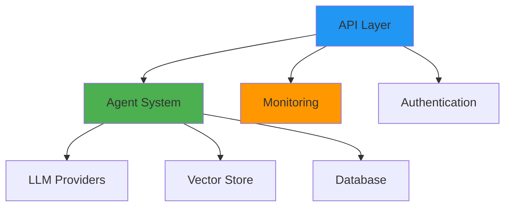

# AI Automation Boilerplate

<div class="grid cards" markdown>

-   :material-clock-fast:{ .lg .middle } __Quick Start__

    ---

    Get up and running in minutes with our comprehensive quick start guide

    [:octicons-arrow-right-24: Getting started](getting-started/quickstart.md)

-   :material-robot:{ .lg .middle } __Agent System__

    ---

    Powerful, modular agent architecture for building AI automation workflows

    [:octicons-arrow-right-24: Learn about agents](user-guide/agents.md)

-   :material-api:{ .lg .middle } __REST API__

    ---

    Full-featured FastAPI application with automatic documentation

    [:octicons-arrow-right-24: API documentation](user-guide/api.md)

-   :material-docker:{ .lg .middle } __Production Ready__

    ---

    Deploy with Docker, Kubernetes, or serverless platforms

    [:octicons-arrow-right-24: Deployment guides](deployment/index.md)

</div>

## Overview

AI Automation Boilerplate is a comprehensive, production-ready framework for building AI automation solutions. It provides:

- **Modular Agent System**: Build complex AI workflows with task and decision agents
- **Enterprise Features**: Monitoring, security, authentication, and compliance
- **Multiple LLM Support**: OpenAI, Anthropic, Groq, and local models
- **Vector Database Integration**: Pinecone, Weaviate, and in-memory storage
- **Production Deployment**: Docker, Kubernetes, and serverless support

## Features

### :material-robot-outline: AI Capabilities

- Task-based and decision-making agents
- Multi-step workflow orchestration
- Vector store for semantic search
- Support for multiple LLM providers
- Async execution with retry logic

### :material-shield-check: Enterprise Ready

- JWT authentication and Auth0 integration
- Prometheus metrics and Sentry error tracking
- Structured logging with context
- Database migrations with Alembic
- Comprehensive API with FastAPI

### :material-test-tube: Developer Experience

- Poetry dependency management
- Pre-commit hooks for code quality
- Ruff for ultra-fast linting and formatting
- MyPy and Pyright for type checking
- Comprehensive test suite with pytest

### :material-security: Security First

- CodeQL security scanning
- SBOM generation for supply chain security
- Trivy vulnerability scanning
- Bandit security linting
- Regular dependency updates via Renovate

## Quick Example

```python
from src.agents.task import TaskAgent, TaskConfig

# Configure an agent
config = TaskConfig(
    name="email_processor",
    description="Process incoming emails",
    max_retries=3,
    timeout=300
)

# Create and run the agent
agent = TaskAgent(config)
result = await agent.execute({"email_id": "123"})
```

## Architecture



## Installation

```bash
# Clone the repository
git clone https://github.com/NickSloggett/ai-automation-repo.git
cd ai-automation-repo

# Install dependencies
poetry install

# Initialize database
poetry run python -m src.cli db init

# Start the API server
poetry run python -m src.cli serve
```

Visit [http://localhost:8000/docs](http://localhost:8000/docs) for interactive API documentation.

## Project Status

This project is actively maintained and production-ready. Current implementation status:

- ✅ Core Infrastructure: **95% Complete**
- ✅ Agent System: **80% Complete**
- ✅ Production Features: **90% Complete**
- ✅ Integration Points: **70% Complete**

## Contributing

We welcome contributions! See our [contributing guide](development/contributing.md) for details.

## License

This project is licensed under the MIT License - see the [LICENSE](https://github.com/NickSloggett/ai-automation-repo/blob/main/LICENSE) file for details.

## Support

- **Documentation**: [Full documentation](https://nicksloggett.github.io/ai-automation-repo/)
- **Issues**: [GitHub Issues](https://github.com/NickSloggett/ai-automation-repo/issues)
- **Discussions**: [GitHub Discussions](https://github.com/NickSloggett/ai-automation-repo/discussions)
